# BISEN API Tester - Technical Architecture Documentation

**Version:** 1.2 BETA  
**Author:** Kuldeep Bisen  
**Last Updated:** December 2024

---

## Table of Contents

1. [System Overview](#system-overview)
2. [High-Level Architecture](#high-level-architecture)
3. [Technology Stack](#technology-stack)
4. [Component Architecture](#component-architecture)
5. [Data Flow Diagrams](#data-flow-diagrams)
6. [Database Schema](#database-schema)
7. [Request Processing Flow](#request-processing-flow)
8. [Security Architecture](#security-architecture)
9. [Deployment Architecture](#deployment-architecture)

---

## System Overview

BISEN (BISEN - Powerful, Elegant & Simple) is a REST API testing tool built as a Spring Boot application. It provides a web-based interface for testing APIs, managing projects, applications, and API requests with environment variable support.

### Key Features
- REST API request execution (GET, POST, PUT, DELETE, PATCH, HEAD, OPTIONS)
- Project > Application > API hierarchy
- Environment variable management
- Request history tracking
- Swagger/OpenAPI import
- API monitoring and health checks
- Request scripting (pre/post-request scripts)
- Export/Import functionality

---

## High-Level Architecture

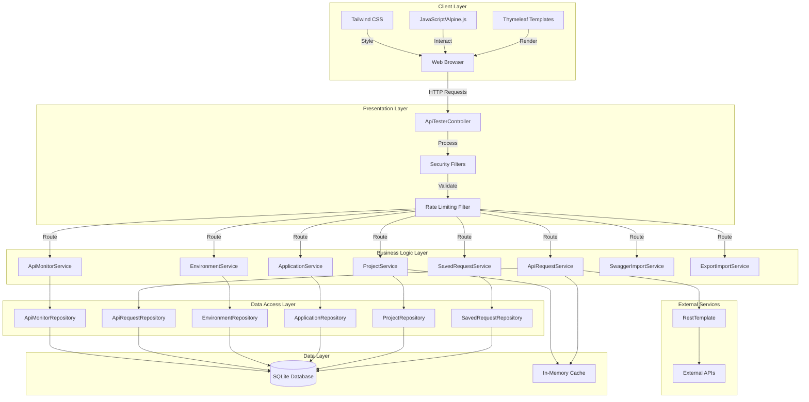

---

## Technology Stack

### Backend Technologies

| Technology | Version | Purpose |
|------------|---------|---------|
| **Java** | 17 | Core programming language |
| **Spring Boot** | 3.2.0 | Application framework and dependency injection |
| **Spring Web** | 3.2.0 | REST API and web MVC support |
| **Spring Security** | 3.2.0 | Authentication and authorization |
| **Spring Data JPA** | 3.2.0 | Database abstraction and ORM |
| **Hibernate** | 6.x | JPA implementation and ORM |
| **SQLite** | 3.44.1.0 | Embedded database for data persistence |
| **HikariCP** | Built-in | Connection pooling for database |
| **Jackson** | Built-in | JSON/YAML serialization and deserialization |
| **Thymeleaf** | Built-in | Server-side template engine for HTML |
| **Swagger Parser** | 2.1.16 | Parse Swagger/OpenAPI specifications |
| **SnakeYAML** | Built-in | YAML parsing for Swagger imports |
| **Spring Cache** | Built-in | In-memory caching layer |

### Frontend Technologies

| Technology | Version | Purpose |
|------------|---------|---------|
| **HTML5** | - | Markup structure |
| **CSS3** | - | Custom styling |
| **Tailwind CSS** | CDN | Utility-first CSS framework |
| **JavaScript (ES6+)** | - | Client-side interactivity |
| **Alpine.js** | 3.13.3 | Lightweight reactive framework |
| **Thymeleaf** | - | Server-side templating |

### Testing Technologies

| Technology | Version | Purpose |
|------------|---------|---------|
| **JUnit 5** | Built-in | Unit testing framework |
| **Playwright** | 1.40.0 | End-to-end testing |
| **Spring Boot Test** | Built-in | Integration testing support |

### Build & Deployment

| Technology | Version | Purpose |
|------------|---------|---------|
| **Maven** | 3.x | Build automation and dependency management |
| **Spring Boot Maven Plugin** | Built-in | Package executable JAR |
| **Maven Assembly Plugin** | 3.6.0 | Create distribution ZIP |

---

## Component Architecture

### Layer-by-Layer Breakdown

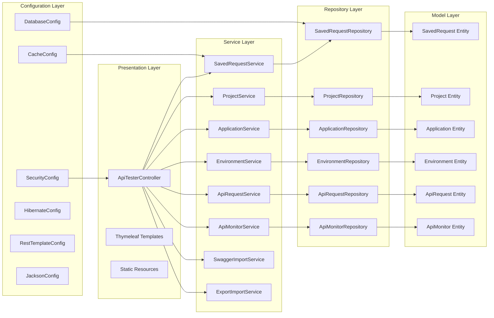

### Component Responsibilities

#### 1. Controller Layer (`ApiTesterController`)

**Responsibilities:**
- Handle HTTP requests and responses
- Route requests to appropriate services
- Prepare model data for Thymeleaf templates
- Validate input data
- Handle exceptions and return appropriate responses

**Key Endpoints:**
- `GET /` - Home page with request builder
- `GET /projects` - Projects management page
- `GET /history` - Request history page
- `POST /api/execute` - Execute API request
- `POST /api/saved` - Save API request
- `GET /api/projects` - Get all projects
- `POST /api/projects` - Create project
- `GET /api/applications/{projectId}` - Get applications by project
- `POST /api/environments` - Create/update environment

#### 2. Service Layer

**SavedRequestService**
- Manage CRUD operations for saved API requests
- Handle request assignment to applications
- Support request duplication
- Manage request deletion (single and bulk)

**ProjectService**
- Manage project lifecycle (create, read, update, delete)
- Provide project listing with applications
- Cache project data for performance

**ApplicationService**
- Manage application lifecycle within projects
- Handle application-project relationships
- Provide application listing with APIs

**EnvironmentService**
- Manage environment variables per application
- Handle variable substitution in requests
- Support environment switching

**ApiRequestService**
- Execute HTTP requests to external APIs
- Handle request/response transformation
- Support variable substitution
- Store request history
- Execute pre/post-request scripts

**ApiMonitorService**
- Schedule and execute API health checks
- Track API status and response times
- Alert on API failures
- Store monitoring history

**SwaggerImportService**
- Parse Swagger/OpenAPI specifications
- Extract API endpoints and schemas
- Create saved requests from Swagger definitions

**ExportImportService**
- Export projects/applications/APIs to JSON
- Import exported data
- Support data migration

#### 3. Repository Layer

**Responsibilities:**
- Abstract database operations
- Provide custom query methods
- Handle entity relationships
- Optimize queries with `@EntityGraph`

**Key Repositories:**
- `SavedRequestRepository` - CRUD for saved requests
- `ProjectRepository` - CRUD for projects
- `ApplicationRepository` - CRUD for applications with `@EntityGraph`
- `EnvironmentRepository` - CRUD for environments
- `ApiRequestRepository` - CRUD for request history
- `ApiMonitorRepository` - CRUD for API monitors

#### 4. Model Layer (Entities)

**Entity Relationships:**

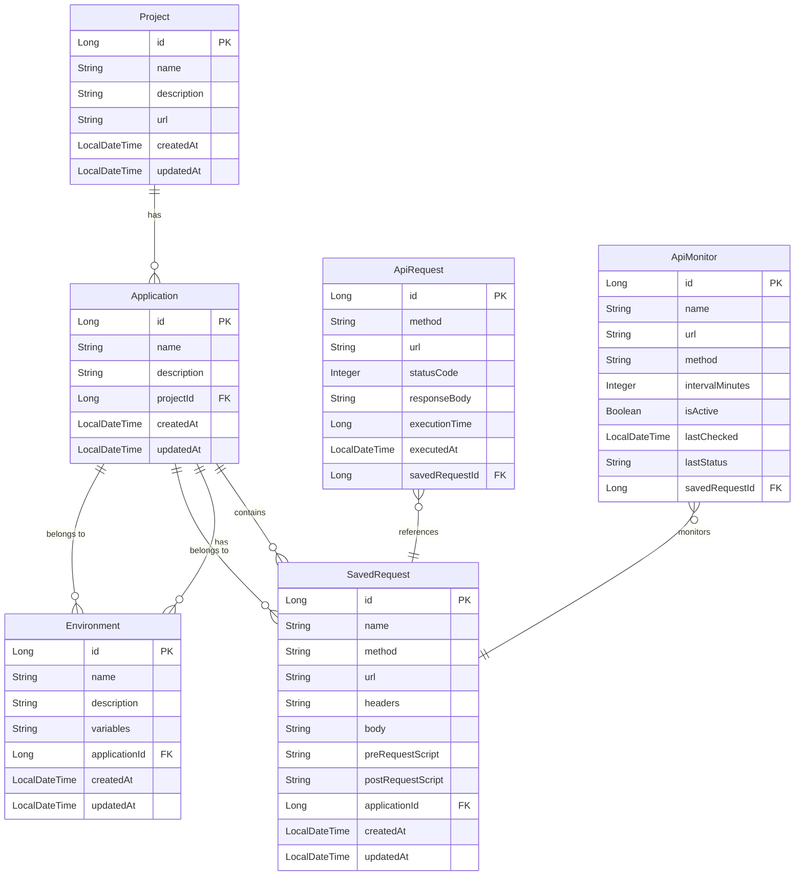

---

## Data Flow Diagrams

### 1. API Request Execution Flow

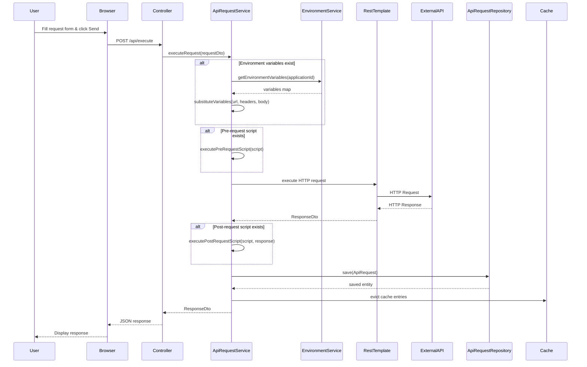

### 2. Save Request Flow

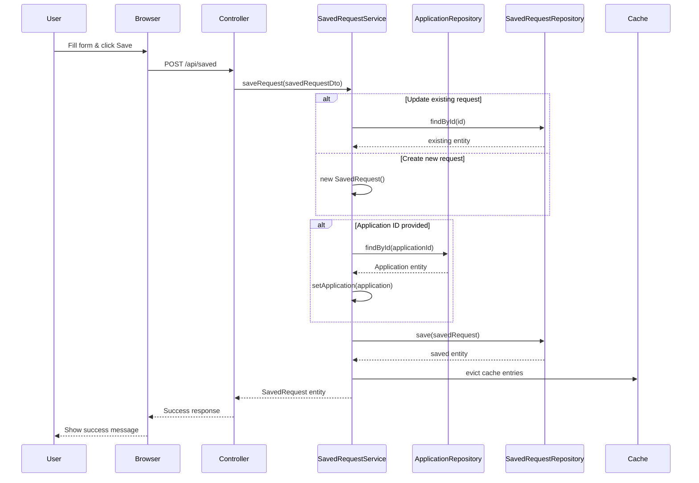

### 3. Project Management Flow

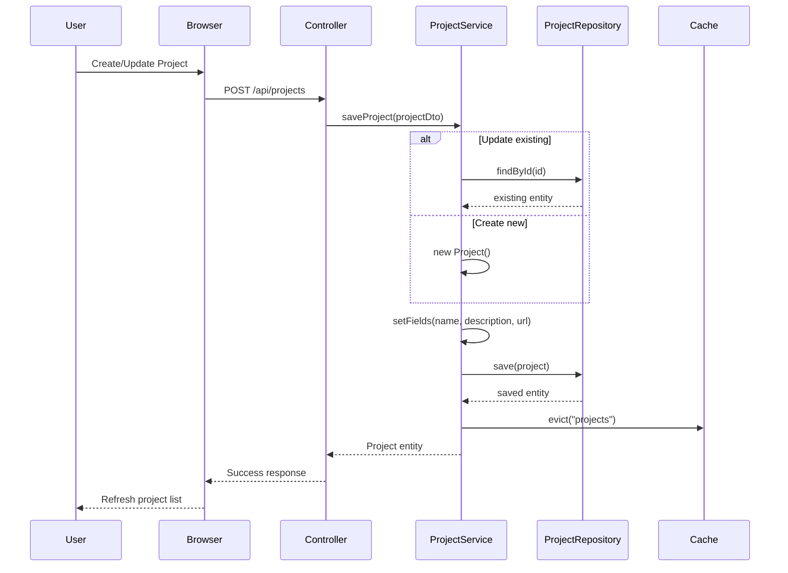

### 4. Environment Variable Substitution Flow

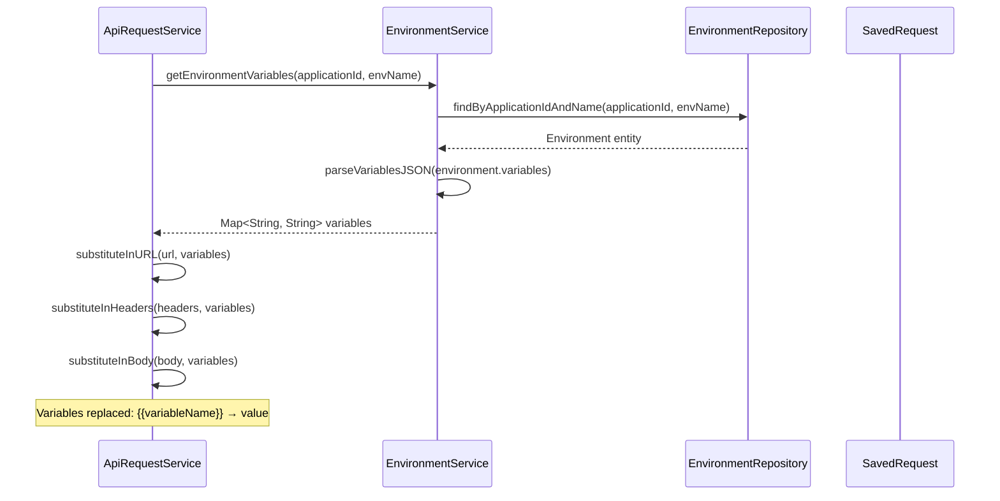

---

## Database Schema

### Complete Schema Diagram

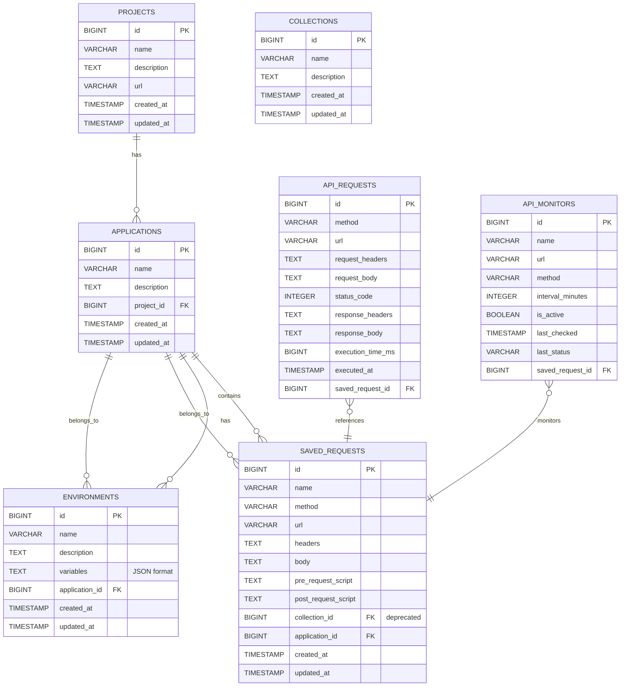

### Indexes

| Table | Index Name | Columns | Purpose |
|-------|------------|---------|---------|
| `projects` | `idx_project_created_at` | `created_at` | Fast sorting by creation date |
| `saved_requests` | `idx_saved_request_application_id` | `application_id` | Fast lookup by application |
| `saved_requests` | `idx_saved_request_created_at` | `created_at` | Fast sorting by creation date |
| `api_requests` | `idx_api_request_status_code` | `status_code` | Fast filtering by status |
| `api_requests` | `idx_api_request_executed_at` | `executed_at` | Fast sorting by execution time |

---

## Request Processing Flow

### Detailed Request Execution

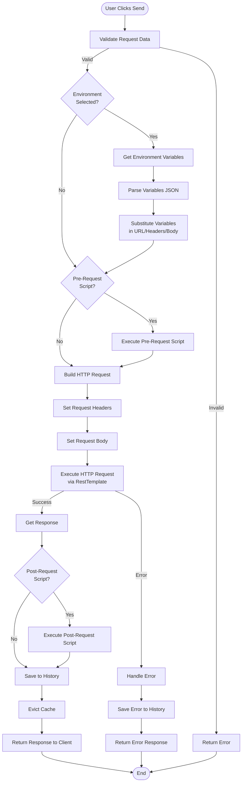

---

## Security Architecture

### Security Layers

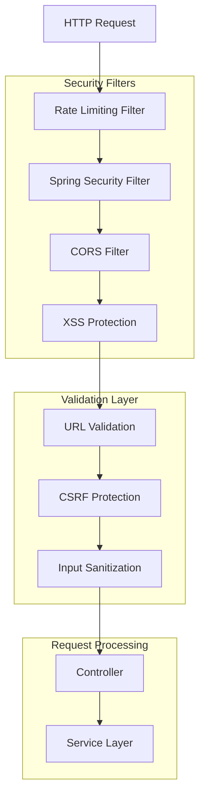

### Security Features

1. **Rate Limiting**
   - Prevents abuse with request rate limits
   - Configurable per endpoint
   - In-memory tracking

2. **Input Validation**
   - URL validation (whitelist/blacklist)
   - XSS prevention
   - SQL injection prevention (via JPA)
   - Request size limits

3. **CORS Configuration**
   - Configurable CORS policies
   - Origin validation

4. **CSRF Protection**
   - Spring Security CSRF tokens
   - Form submission validation

---

## Deployment Architecture

### Single-JAR Deployment

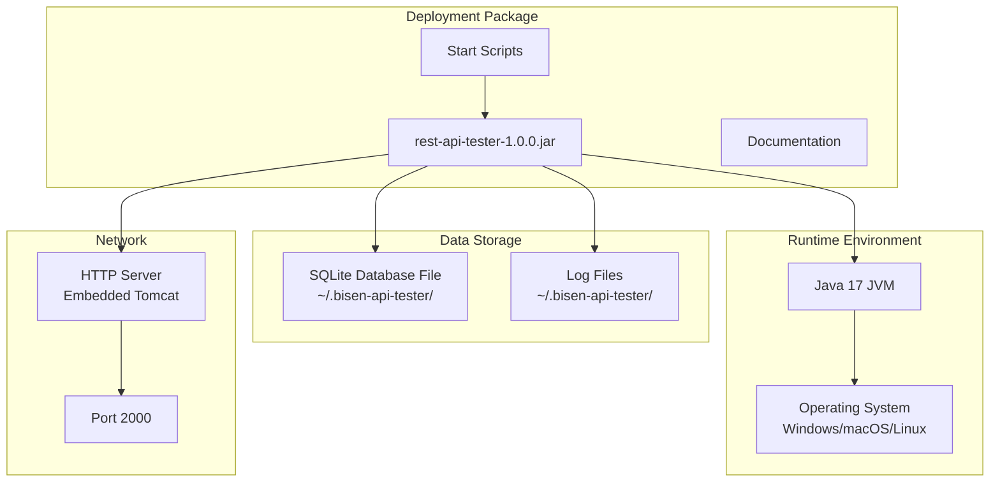

### Deployment Characteristics

- **Self-contained**: Single JAR file with all dependencies
- **Embedded Server**: Tomcat embedded in Spring Boot
- **File-based Database**: SQLite database in user directory
- **No External Dependencies**: No need for separate database server
- **Cross-platform**: Works on Windows, macOS, and Linux
- **Portable**: Can run from any directory

---

## Low-Level Design Details

### 1. Caching Strategy

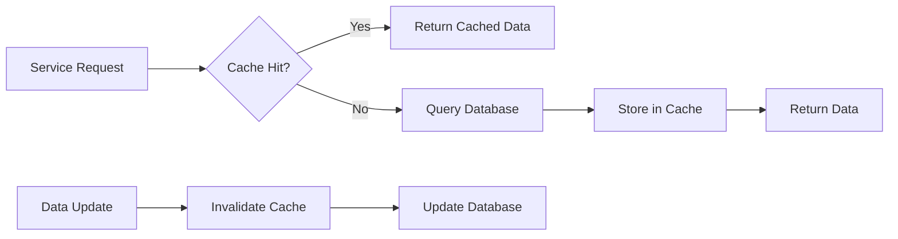

**Cache Configuration:**
- **Type**: In-memory (ConcurrentMapCacheManager)
- **Cached Entities**: Projects, Applications (read-heavy)
- **TTL**: No expiration (manual eviction on updates)
- **Eviction Strategy**: Manual eviction on create/update/delete

### 2. Connection Pooling

**HikariCP Configuration:**
- **Maximum Pool Size**: 10 connections
- **Minimum Idle**: 2 connections
- **Connection Timeout**: 30 seconds
- **Idle Timeout**: 10 minutes
- **Max Lifetime**: 30 minutes
- **Leak Detection**: 60 seconds

### 3. Transaction Management

- **Default**: Spring's `@Transactional` with read-only optimization
- **Isolation Level**: Default (READ_COMMITTED for SQLite)
- **Propagation**: REQUIRED (default)

### 4. Exception Handling

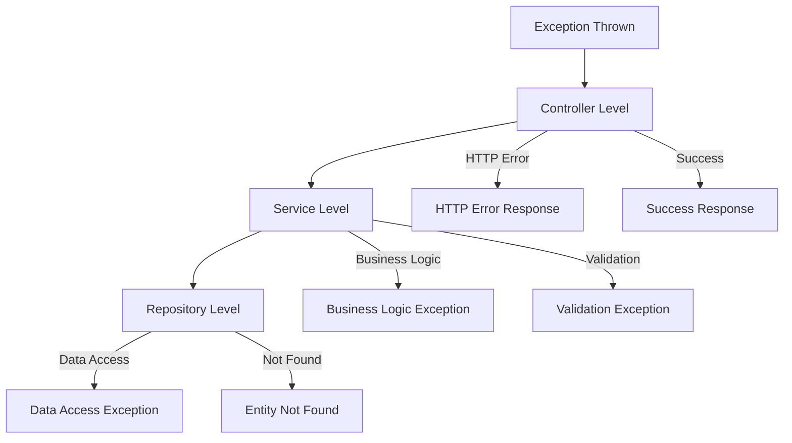

---

## Performance Optimizations

### 1. Database Optimizations
- **Indexes**: On foreign keys and frequently queried columns
- **Lazy Loading**: For `@OneToMany` relationships
- **@EntityGraph**: Eager loading when needed to avoid N+1 queries
- **Batch Operations**: For bulk inserts/updates

### 2. Caching
- **Read-heavy operations**: Projects and Applications cached
- **Cache eviction**: On data modifications
- **In-memory cache**: Fast access for frequently accessed data

### 3. Query Optimization
- **Custom queries**: Optimized with `@Query` annotations
- **Pagination**: For large result sets (future enhancement)
- **Projection**: DTOs for minimal data transfer

### 4. Connection Pooling
- **HikariCP**: High-performance connection pool
- **Connection reuse**: Reduces connection overhead
- **Leak detection**: Prevents connection leaks

---

## API Endpoints Summary

### REST API Endpoints

| Method | Endpoint | Purpose | Service |
|--------|----------|---------|---------|
| GET | `/` | Home page | Controller |
| GET | `/projects` | Projects page | Controller |
| GET | `/history` | History page | Controller |
| POST | `/api/execute` | Execute API request | ApiRequestService |
| POST | `/api/saved` | Save request | SavedRequestService |
| GET | `/api/saved` | Get all saved requests | SavedRequestService |
| DELETE | `/api/saved/{id}` | Delete request | SavedRequestService |
| GET | `/api/projects` | Get all projects | ProjectService |
| POST | `/api/projects` | Create/update project | ProjectService |
| DELETE | `/api/projects/{id}` | Delete project | ProjectService |
| GET | `/api/applications/{projectId}` | Get applications | ApplicationService |
| POST | `/api/applications` | Create application | ApplicationService |
| POST | `/api/environments` | Create/update environment | EnvironmentService |
| GET | `/api/history` | Get request history | ApiRequestService |
| POST | `/api/import/swagger` | Import Swagger | SwaggerImportService |

---

## Future Enhancements

### Planned Improvements
1. **Multi-user support**: User authentication and authorization
2. **Team collaboration**: Shared projects and APIs
3. **API collections**: Group related APIs
4. **GraphQL support**: Test GraphQL APIs
5. **WebSocket testing**: Real-time API testing
6. **Performance testing**: Load testing capabilities
7. **API documentation**: Auto-generate API docs
8. **CI/CD integration**: Integrate with Jenkins/GitHub Actions

---

## Conclusion

BISEN API Tester is built on a modern, scalable architecture using Spring Boot and follows best practices for:
- **Separation of Concerns**: Clear layer separation
- **Dependency Injection**: Spring's IoC container
- **Database Abstraction**: JPA/Hibernate ORM
- **Security**: Multiple security layers
- **Performance**: Caching and connection pooling
- **Maintainability**: Clean code structure and documentation

The architecture supports future enhancements while maintaining simplicity and performance.

---

**Document Version:** 1.0  
**Last Updated:** December 2024  
**Maintained By:** Development Team

